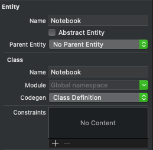
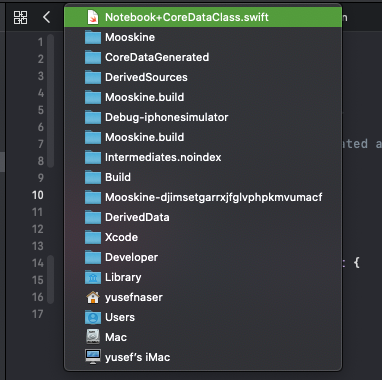
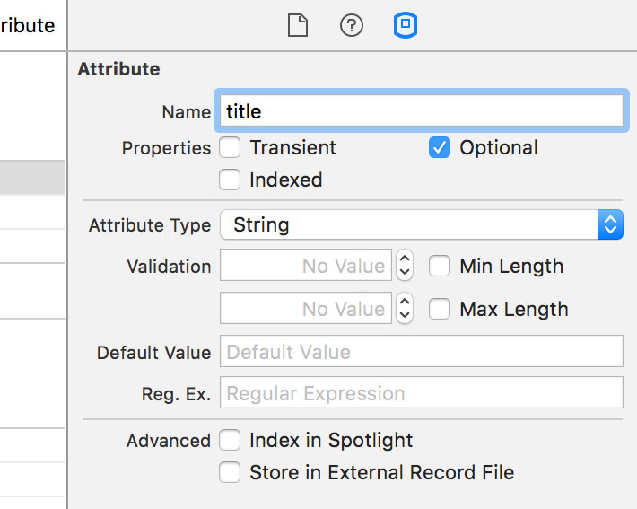

[Ali Akhtar on medium](https://medium.com/@aliakhtar_16369/mastering-in-core-data-part-0-5a529c6c5a93)

[10 tips for core data](https://medium.com/ios-os-x-development/10-core-principles-to-use-coredata-without-blowing-your-head-off-5ed11c623c6b)

[core data codegen explained](https://medium.com/@kahseng.lee123/core-data-codegen-explained-462c30341041)

[Configuring Attributes](https://developer.apple.com/documentation/coredata/modeling_data/configuring_attributes?language=objc)

[Configuring Relationships](https://developer.apple.com/documentation/coredata/modeling_data/configuring_relationships)

[Creating Managed Object Relationships](https://developer.apple.com/library/archive/documentation/Cocoa/Conceptual/CoreData/HowManagedObjectsarerelated.html#//apple_ref/doc/uid/TP40001857-185436%20//apple_ref/doc/uid/TP40001075-CH17-SW2)

[Apple Documentation](https://developer.apple.com/documentation/coredata)

[raywenderlich](https://www.raywenderlich.com/books/core-data-by-tutorials/v7.0/chapters/i-what-you-need)

[Apple Core Data](https://developer.apple.com/library/archive/documentation/DataManagement/Devpedia-CoreData/Introduction.html#//apple_ref/doc/uid/TP40010398-CH33-DontLinkElementID_2)

## How Does Core Data Save Data?
-  **Persistent Stores**
- Core Data saves (or persists) data into something called a persistent store (think storage). The store is where the data lives.

- **Types of Stores**
- There are three different types of persistent stores Core Data supports on iOS:
    - a SQLite store (the default)
    - a binary store
     - an in-memory store.

- **SQLite**
- SQLite is almost always the right choice for your persistent store; it means your data is stored in a SQL relational database, and there are a few handy features in Core Data (like model caching during migration) that only work with the SQLite store. And since you don’t interact with the persistent store directly, you don’t need to know any SQL to use the SQLite store.

- **In-memory**
- The in-memory and binary stores have different characteristics in terms of memory usage and performance. The in-memory store can be appropriate when you have a small data model that can fit in memory all at once and that doesn’t need to be saved to disk – for example a cache.

- **Binary**
- The binary store can be appropriate when you always need the database to be read and written in its entirety—for example if you are using a file format such as CSV.

- **Abstracting the Store**
- Core Data abstracts the persistent store's details. That means you won’t usually interact with the store directly. You can think of Core Data as a layer that sits between your code and the underlying store, making it easier for the two to communicate.
- Core Data provides a common interface for saving and fetching data, no matter what kind of store sits below. Whatever type of store you choose, you’ll always use the same Core Data classes to access and manage your data. And you won't need to learn a database-specific language to manage your data; you can do it all in Swift.

## Entities
- An entity is represented by an instance of the `NSEntityDescription` class. This class provides access to a wide range of properties, such as its name, the data model it is defined in, and the name of the class the entity is represented by. In short, the `NSEntityDescription` class gives you access to every bit of information Core Data has about an entity. This brings us to properties.

- This image is an Enitiy in inspector and contain
1 - Entity / Name : is an entity name in data model
2 - class / Name : is a class name that xcode generated
3 - class / Codegen : There is three types  
    - **Manual / None**:  where developer have to manually create and maintain the changes of the NSManagedObject subclasses.
    - **Category / Extensions** : This configuration can be describe as in between of `Class Definition` and `Manual/None`. Xcode will only automatically generate `TestEntity+CoreDataProperties.swift` for you and you will have to manage and maintain `TestEntity+CoreDataClass.swift` yourself.
    - **Class Definition** : Xcode will automatically generate the required NSManagedObject subclass as part of the project’s derived data.
    
    **this image show you where autogenerated file is located**
    
    
    

## What Are Core Data Properties?
- The difference is between properties, attributes, and relationships in the context of Core Data. The difference is straightforward. Attributes and relationships are both properties. The term property is used to refer to both attributes and relationships.

> Attributes and relationships are both properties.

## Attributes
- You can think of attributes as the columns of a table in a database. Attributes store the values of a Core Data record. There are several types of attributes, such as String, Date, Integer, Float, and Boolean.

- Every attribute type has different configuration options in the *Attributes Inspector*. The *String* attribute type, for example, allows you to set a default value and to add validation rules. It goes without saying that attributes are much more than the columns of a table in a database.

**Attribute Types**
- Core Data includes a number of built-in attribute types for numbers, booleans, strings and other types of data.
- Many of these are stored internally as NSNumbers due to the Objective-C heritage of Core Data, but the generated Swift files for your entities will have properties with Swift Standard Library or Foundation types.
    - `Integer 16`, `Integer 32`, and `Integer 64` types generate Int16, Int32, and Int64 properties respectively.
    - The `Decimal` attribute type will create a corresponding NSDecimalNumber property.
    - `Float` and `Double` will map to the Float and Double Swift equivalents.
    - `String` also maps to its Swift counterpart. Bool will as well, although it is stored as number internally.
    - `Date` becomes an NSDate (rather than the more modern Date type, unfortunately)
    - The `UUID` attribute type will create a corresponding UUID-typed property
    - The `URI` attribute type creates a corresponding URL-typed property
    - The `Binary` attribute type allows you to store arbitrary data, and includes an option to store larger files separately on disk.
    - `Transformable` is handy for storing classes that conform to NSCoding – it automatically converts such classes to and from a binary representation when storing them. Since many common Foundation classes conform to NSCoding, this allows you to easily store many Foundation types directly in Core Data.

## Relationships
- Relationships are also properties. Instead of storing values, they store a reference to another (or the same) Core Data record. Before we can add a relationship, we need to add another entity.

- **Two-sided Relationships**
    - You might be wondering why Core Data created a two-sided relationship between the entities, since in our Swift code, we only modeled the relationship in one direction.
    - If you’ve worked with databases, you might even be wondering if it would be easier to just include an ID field instead of explicitly creating relationships.
    - *Core Data uses two-sided relationships.*
    - Think about what happens when a note or a notebook is deleted. When a note is deleted, we don’t want to make any changes to the other notes – and we certainly wouldn’t want to delete the whole notebook.
    - But when a notebook is deleted, we’ll want to delete all of its notes. If we were using an ID field, there would be a lot of bookkeeping to make sure we deleted all the notes that referenced a deleted notebook.
    - Core Data includes functionality to model deletion behavior. Modelling the relationship in both directions lets Core Data traverse the web of entity class instances (also known as the “object graph”) and make sure all affected references are updated. This is called referential integrity.
- **Deletion Rules**
    - For our notes relationship, choosing the `Cascade` rule will mean that deleting a Notebook will cause all of its referenced notes to be deleted.
    - For our notebook relationship in Note, choosing `Nullify` means that the relationship will simply be removed, but the referenced Notebook remains.

## Core Data Stack
1- Managed Object Context
- A managed object context represents a single object space, or scratch pad, in a Core Data application. A managed object context is an instance of NSManagedObjectContext. Its primary responsibility is to manage a collection of managed objects. These managed objects represent an internally consistent view of one or more persistent stores. The context is a powerful object with a central role in the life-cycle of managed objects, with responsibilities from life-cycle management (including faulting) to validation, inverse relationship handling, and undo/redo.

- From your perspective, the context is the central object in the Core Data stack. It’s the object you use to create and fetch managed objects, and to manage undo and redo operations. Within a given context, there is at most one managed object to represent any given record in a persistent store.

- A context is connected to a parent object store. This is usually a persistent store coordinator, but may be another managed object context. When you fetch objects, the context asks its parent object store to return those objects that match the fetch request.` Changes that you make to managed objects are not committed to the parent store until you save the context and doesn't update the UI`. In some applications, you may have just a single context. In others, however, you might have more than one. You might want to maintain discrete sets of managed objects and edits to those objects; or you might want to perform a background operation using one context while allowing the user to interact with objects in another.

- A managed object context is an in-memory scratchpad for working with your managed objects. Most apps need just a single managed object context. The default configuration in most Core Data apps is a single managed object context associated with the main queue. Multiple managed object contexts make your apps harder to debug; it’s not something you’d use in every app, in every situation.

- That being said, certain situations do warrant the use of more than one managed object context. For example, long-running tasks, such as exporting data, will block the main thread of apps that use only a single main-queue managed object context and cause the UI to stutter.

- In other situations, such as when edits are being made to user data, it’s helpful to treat a managed object context as a set of changes that the app can discard if it no longer needs them. Using child contexts makes this possible.

### Treat with multiple managed object context [raywenderlich](https://www.raywenderlich.com/7586-multiple-managed-object-contexts-with-core-data-tutorial)

2- Managed Object Model
- A managed object model is a set of objects that together form a blueprint describing the managed objects you use in your application. A model allows Core Data to map from records in a persistent store to managed objects that you use in your application. It is a collection of entity description objects (instances of NSEntityDescription). An entity description describes an entity `(which you can think of as a table in a database) in terms of its name, the name of the class used to represent the entity in your application, and what properties (attributes and relationships) it has.`

- The managed object model is an instance of NSManagedObjectModel and describes the schema used in your Core Data application. It is loaded from the model file which contains all the entity descriptions with their attributes and relationships that you defined in the Core Data Model inspector. So the model describes your objects.

3- Persistent Store Coordinator
- The persistent store coordinator uses both: The NSManagedObjectModel and (one or more) NSPersistentStores, to load managed objects from the store into the application and to write changed objects back into the store.
- it translate store records (Managed object model) into managed objects  and Managed objects into Records.

4- Persistent Container
- A Core Data model defines what your data should look like, but it doesn't actually store the real data anywhere. To make our app work, we need to load that model, create a real working database from it, load that database, then prepare what’s called a “managed object context” – an environment where we can create, read, update, and delete Core Data objects entirely in memory, before writing back to the database in one lump.

- This all used to be a massive amount of work, to the point where it would put people off Core Data for life. But from iOS 10 onwards, Apple rolled all this work up into a single new class called NSPersistentContainer. This has removed almost all the tedium from setting up Core Data, and you can now get up and running in just a few lines of code.

### The persistent object store is an instance of NSPersistentStore, which manages the transactions to and from a persistent store, which is the repository where the actual data is stored. In many cases, the persistent store is a SQLite file, but it can also be an XML file, a binary file or a "in-memory" store for temporary data.
